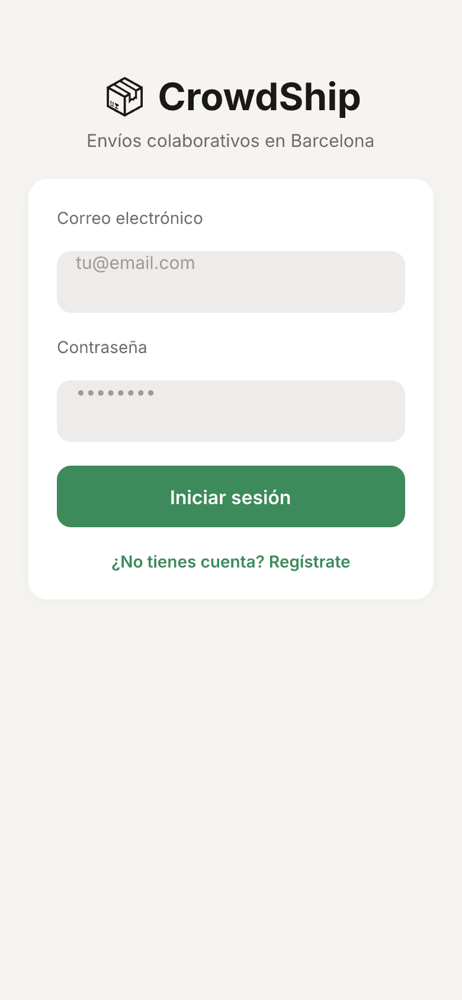
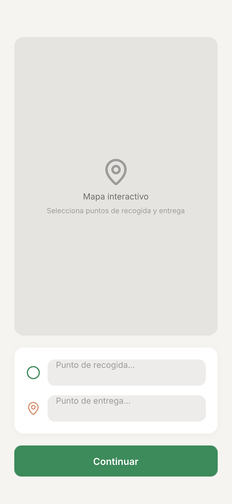
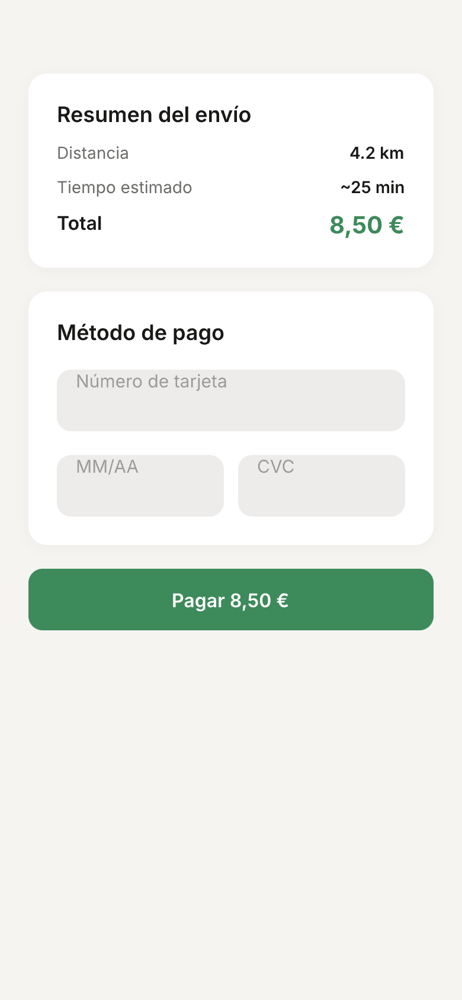

# App de Crowdshipping (Barcelona)

Plataforma móvil de logística colaborativa que conecta remitentes con conductores independientes para optimizar la entrega de paquetes en Barcelona.

---

## 1. Idea del Proyecto

Este proyecto consiste en una **plataforma móvil de crowdshipping** (logística colaborativa) que conecta a personas o empresas que necesitan enviar paquetes con conductores independientes que aprovechan sus rutas y desplazamientos diarios para realizar dichas entregas.

### Problema que resuelve

- **Optimiza la logística de última milla**, la cual suele ser costosa y un desafío para las empresas de mensajería tradicionales.
- **Reduce el impacto medioambiental** al aprovechar los viajes que los conductores ya tenían planeado realizar de todos modos.

### A quién va dirigido

El sistema tiene un **mercado de dos caras**:

| Perfil | Descripción |
|--------|-------------|
| **Remitentes (Shippers)** | Usuarios en Barcelona que buscan envíos rápidos, económicos y eficientes. |
| **Conductores (Drivers)** | Conductores ocasionales o freelance que desean rentabilizar sus trayectos ganando ingresos extra. |

### Propósito principal

Facilitar un **emparejamiento eficiente (matching)** entre la oferta y la demanda logística mediante un ecosistema digital confiable, seguro y fácil de usar.

---

## 2. Requisitos Funcionales

### Para el Usuario Remitente (Shipper)

| Requisito | Descripción |
|-----------|-------------|
| **Gestión de cuenta** | Registro, inicio de sesión seguro y gestión del perfil. |
| **Solicitud de envío** | Introducción de ubicación de recogida, destino y franja horaria deseada para la entrega. |
| **Pagos en línea** | Pago seguro del coste del envío mediante tarjetas de crédito/débito o billeteras digitales. |
| **Seguimiento en tiempo real** | Rastreo de la ubicación GPS del paquete y del conductor en un mapa interactivo durante la entrega. |
| **Sistema de valoración** | Calificación del conductor al finalizar el servicio para garantizar calidad y seguridad. |

### Para el Usuario Conductor (Driver)

| Requisito | Descripción |
|-----------|-------------|
| **Recepción de tareas** | Notificaciones sobre solicitudes de envío cercanas a su ruta. |
| **Aceptación y navegación** | Aceptar o rechazar paquetes y utilizar navegación paso a paso integrada para llegar a puntos de recogida y entrega. |
| **Cobro de recompensas** | Monedero digital o historial con ganancias y facilidades para el cobro por servicios prestados. |

---

## 3. Mockups

Los wireframes diseñados priorizan una jerarquía visual clara, botones de Llamada a la Acción (CTA) prominentes y un diseño adaptado para uso cómodo con el pulgar en dispositivos móviles.

**Herramienta utilizada:** Figma

| Figura | Descripción |
|-------|-------------|
| **Figura 1** | Pantalla de inicio de sesión y registro de usuarios. |
| **Figura 2** | Interfaz principal con el mapa para seleccionar puntos de recogida y entrega. |
| **Figura 3** | Pasarela de pago integrada con resumen de la transacción. |





---

## 4. Arquitectura y Tecnología

La plataforma utiliza una arquitectura basada en **tecnologías híbridas** y **servicios en la nube (Backend as a Service - BaaS)** para un despliegue rápido, eficiente y escalable.

### Stack tecnológico

| Capa | Tecnología | Descripción |
|------|------------|-------------|
| **Frontend** | React Native | Una única base de código (JavaScript/TypeScript) para iOS y Android. Rendimiento cercano al nativo y posibilidad de versión web futura. |
| **Backend** | Firebase | BaaS para autenticación, base de datos NoSQL en tiempo real (Cloud Firestore) y Cloud Functions para lógica de negocio y emparejamiento. |
| **Mapas** | Mapbox | SDK para mapas, geolocalización, enrutamiento y seguimiento en tiempo real. Modelo de precios económico y alta personalización. |
| **Pagos** | Stripe + PayPal | Stripe como procesador principal (API REST y SDK móvil, PCI DSS). PayPal como alternativa para usuarios europeos. |

### Estructura general

```
┌─────────────────────────────────────────────────────────────┐
│                    React Native (Frontend)                   │
└─────────────────────────────────────────────────────────────┘
         │                    │                    │
         ▼                    ▼                    ▼
┌──────────────┐    ┌──────────────┐    ┌──────────────┐
│   Firebase   │    │    Mapbox    │    │    Stripe    │
│  (Auth, DB,  │    │   (Mapas,    │    │   (Pagos)   │
│  Functions)  │    │  Rutas, GPS) │    │    PayPal    │
└──────────────┘    └──────────────┘    └──────────────┘
```

La aplicación actúa como cliente directo, comunicándose en tiempo real con Firebase para actualizaciones de estado y mapas de Mapbox. Las validaciones críticas (como el cobro seguro en Stripe) se delegan a las **Cloud Functions** de Firebase, manteniendo la arquitectura segura y desacoplada.

---

## Instalación

```bash
# Clonar el repositorio
git clone <url-del-repositorio>
cd App_Transporte

# Instalar dependencias
npm install

# Ejecutar en desarrollo
npm run android  # o npm run ios
```

---

## Licencia

[Especificar licencia del proyecto]
