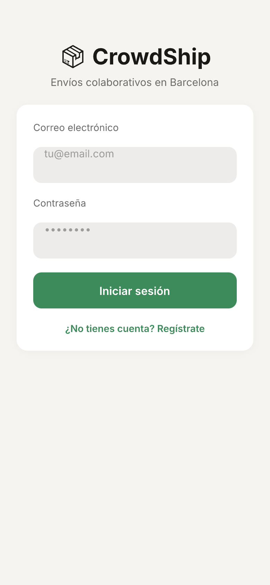
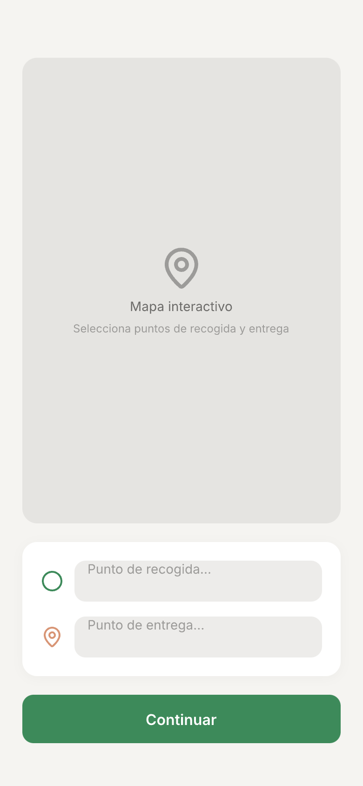
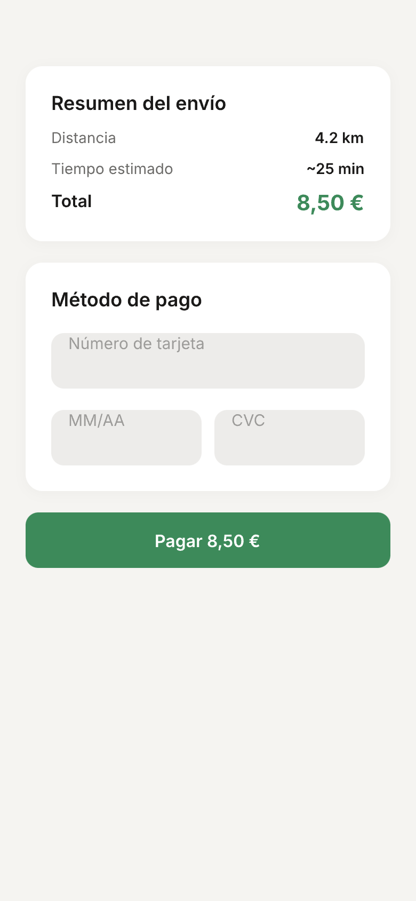

# Crowdshipping y mudanzas compartidas

> **Projecte final de 2n curs — CFGS Desenvolupament d'Aplicacions Web (DAW)**

---

Plataforma mòbil i web d'**economia col·laborativa** que connecta persones o empreses que necessiten **enviar paquets o fer mudances** amb **transportistes independents**, optimitzant rutes i reduint costos mitjançant _task-bundling_.

> Client **React Native + Expo (TypeScript)**, backend **Firebase** (Auth, Firestore, Storage, Cloud Functions), mapes **Mapbox** i pagaments **Stripe**. Una sola base de codi per a iOS, Android i web.

[](https://github.com/AlbertCaminal/App_Transportes/actions/workflows/ci.yml)
   

---

## Índice

1. [Resumen del proyecto](#1-resumen-del-proyecto)
2. [Objetivos](#2-objetivos)
3. [Alcance entregado vs planificado](#3-alcance-entregado-vs-planificado)
4. [Cómo evaluar el proyecto en 5 minutos](#4-cómo-evaluar-el-proyecto-en-5-minutos)
5. [Inicio rápido (instalación completa)](#5-inicio-rápido-instalación-completa)
6. [Estructura del repositorio](#6-estructura-del-repositorio)
7. [Producto y funcionalidades](#7-producto-y-funcionalidades)
8. [Arquitectura](#8-arquitectura)
9. [Configuración de servicios](#9-configuración-de-servicios)
10. [Calidad de código y pruebas](#10-calidad-de-código-y-pruebas)
11. [Publicación (Play, App Store, web)](#11-publicación-play-app-store-web)
12. [Mockups](#12-mockups)
13. [Conclusiones y aprendizajes](#13-conclusiones-y-aprendizajes)
14. [Posibles ampliaciones](#14-posibles-ampliaciones)
15. [Bibliografía y referencias](#15-bibliografía-y-referencias)
16. [Licencia](#16-licencia)

---

## 1. Resumen del proyecto

**Crowdshipping y mudanzas compartidas** es una aplicación que se entrega como **prototipo funcional multiplataforma** (iOS, Android y web) y que demuestra, sobre un caso de uso real, los conocimientos adquiridos durante el ciclo:

- **Cliente** desarrollado con React Native + Expo en **TypeScript estricto**, con estado global, internacionalización (català/español/inglés), navegación entre pantallas y componentes accesibles.
- **Backend serverless** sobre Firebase: autenticación (Google + correo/contraseña + invitado anónimo), base de datos en tiempo real con reglas de seguridad propias y funciones en la nube.
- **Buenas prácticas de ingeniería**: pruebas unitarias y de componentes con Jest, ESLint endurecido, Prettier, Husky + lint-staged y CI con GitHub Actions.
- **Diseño orientado a producto**: UX _thumb-friendly_, mapas a pantalla completa, feedback claro al usuario y soporte multilenguaje desde el primer día.

El proyecto se estructura como un **MVP** real, listo para evolucionar hacia producción una vez integradas las pasarelas de pago (Stripe) y los mapas en producción (Mapbox), que se han diseñado pero quedan fuera del alcance de la entrega académica.

---

## 2. Objetivos

### 2.1. Objetivo general

Diseñar e implementar una **plataforma multiplataforma de crowdshipping** que permita a un cliente solicitar un envío y a un transportista aceptarlo, con autenticación real, persistencia en la nube y reglas de seguridad propias, aplicando los contenidos del ciclo DAW.

### 2.2. Objetivos específicos

| #   | Objetivo                                                                                       | Cubierto por                                                                  |
| --- | ---------------------------------------------------------------------------------------------- | ----------------------------------------------------------------------------- |
| O1  | Construir una **única base de código** que se ejecute en iOS, Android y web                    | Expo + `react-native-web` (§ 8)                                               |
| O2  | Aplicar **TypeScript estricto** y separación en capas (componentes, hooks, servicios, utils)   | Estructura de `src/` (§ 6)                                                    |
| O3  | Implementar **autenticación segura** con varios proveedores                                    | Firebase Auth: Google, correo/contraseña e invitado (§ 9.2)                   |
| O4  | Persistir datos en la nube con **reglas de seguridad** propias                                 | Firestore + [`firestore.rules`](firestore.rules) (§ 9.2)                      |
| O5  | Aplicar **internacionalización** completa (ca / es / en) con paridad de claves verificada      | `i18n-js` + tests de locales (§ 7.4)                                          |
| O6  | Garantizar la **calidad del código** mediante linter, formateador, hooks de Git y CI           | ESLint, Prettier, Husky, GitHub Actions (§ 10)                                |
| O7  | Cubrir la lógica crítica con **pruebas automatizadas** (unitarias, de componente y de reglas)  | Jest + `@testing-library/react-native` + emulador (§ 10)                      |
| O8  | Diseñar la app pensando en **publicación real** (tiendas y web estática)                       | EAS, `app.config.ts`, [`docs/STORE_RELEASE.md`](docs/STORE_RELEASE.md) (§ 11) |
| O9  | Documentar el proyecto con un nivel **profesional**, incluyendo arquitectura técnica detallada | Este README + [`docs/ARCHITECTURE.md`](docs/ARCHITECTURE.md)                  |

---

## 3. Alcance entregado vs planificado

La aplicación se entrega como **MVP funcional**. La siguiente tabla diferencia con claridad lo que **se ha implementado y se puede evaluar** y lo que **queda como trabajo futuro**:

| Capa                          | Tecnología                                                                                                                                                         | Estado en la entrega                                                       |
| ----------------------------- | ------------------------------------------------------------------------------------------------------------------------------------------------------------------ | -------------------------------------------------------------------------- |
| Cliente móvil/web             | React Native (Expo, TypeScript estricto)                                                                                                                           | **Implementado** — corre en iOS, Android y web                             |
| UI y navegación               | Componentes propios + `lucide-react-native`                                                                                                                        | **Implementado**                                                           |
| Estado global                 | Zustand (`src/store/appStore.ts`)                                                                                                                                  | **Implementado** — con tests                                               |
| Internacionalización          | `i18n-js` + `expo-localization` (ca/es/en)                                                                                                                         | **Implementado** — paridad de claves verificada por test                   |
| Autenticación                 | Firebase Auth — **Google** (`expo-auth-session`), **correo/contraseña** (login + registro), **invitado anónimo**, _upgrade_ invitado→Google (`linkWithCredential`) | **Implementado** — pendiente Apple Sign-In en iOS si se publica con Google |
| Base de datos                 | Firestore — `users/{uid}` (perfil/sesión) y **`requests`** (solicitud al confirmar envío en cliente; reglas por `clientId`)                                        | **Implementado (MVP)** — con reglas propias y pruebas                      |
| Almacenamiento                | Firebase Storage (fotos de paquete) + reglas                                                                                                                       | **Implementado**                                                           |
| Funciones en la nube          | Cloud Functions: `onShippingRequestCreate`, `claimShippingRequest`                                                                                                 | **Implementado** (estructura básica desplegable)                           |
| Observabilidad                | `@sentry/react-native` (opcional vía DSN)                                                                                                                          | **Implementado**                                                           |
| Calidad                       | Jest + Testing Library, ESLint endurecido, Prettier, Husky, lint-staged                                                                                            | **Implementado**                                                           |
| Integración continua          | GitHub Actions (`typecheck` / `lint` / `test`)                                                                                                                     | **Implementado**                                                           |
| Mapas y rutas                 | Mapbox SDK                                                                                                                                                         | _Planificado_ — pantallas y _mockups_ ya preparados                        |
| Pagos                         | Stripe (PaymentIntents + webhooks)                                                                                                                                 | _Planificado_                                                              |
| Algoritmo de _matching_ (FPD) | Descomposición fluido-partícula                                                                                                                                    | _Planificado_                                                              |

> El detalle técnico completo está en [`docs/ARCHITECTURE.md`](docs/ARCHITECTURE.md).

---

## 4. Cómo evaluar el proyecto en 5 minutos

Esta sección está pensada para que el **tribunal o el profesor** pueda probar la aplicación sin tener que configurar nada externo.

### 4.1. Opción A — Solo ver el código y la documentación

1. Abrir este `README.md`.
2. Consultar [`docs/ARCHITECTURE.md`](docs/ARCHITECTURE.md) para los detalles técnicos.
3. Revisar las carpetas clave: `src/components`, `src/hooks`, `src/services/firebase`, `src/store`, `firestore.rules` y `functions/`.
4. Ver el resultado de la **CI** en el _badge_ verde de la cabecera.

### 4.2. Opción B — Ejecutar la app en modo demo (sin Firebase)

Sin variables de entorno, la app **arranca igual** y se puede navegar por toda la UI; el _bootstrap_ de Auth/Firestore queda inactivo (en desarrollo aparecerá un aviso en la consola, lo cual es esperado).

```bash
git clone https://github.com/AlbertCaminal/App_Transportes
cd App_Transportes
npm install
npx expo start
```

A continuación:

| Plataforma  | Cómo abrirla                                                                  |
| ----------- | ----------------------------------------------------------------------------- |
| **Web**     | Pulsa `w` en la terminal de Expo (la app soporta web vía `react-native-web`). |
| **Android** | Pulsa `a` o escanea el QR con [Expo Go](https://expo.dev/go).                 |
| **iOS**     | Pulsa `i` (macOS con Xcode) o escanea el QR con Expo Go.                      |

### 4.3. Opción C — Ejecutar con backend real (Firebase)

1. Crear un proyecto en [Firebase Console](https://console.firebase.google.com/).
2. Copiar las claves a un archivo `.env.local` (a partir de [`.env.example`](.env.example)).
3. `npm run deploy:firebase` para desplegar reglas de Firestore, Storage y Cloud Functions.
4. `npm install && npx expo start`.

> Los pasos detallados (Auth, Google Sign-In, despliegue, etc.) están en la **§ 9. Configuración de servicios**.

---

## 5. Inicio rápido (instalación completa)

Requisitos: [Node.js](https://nodejs.org/) LTS (20+ recomendado) y, para dispositivo físico, [Expo Go](https://expo.dev/go).

```bash
git clone https://github.com/AlbertCaminal/App_Transportes
cd App_Transportes
cp .env.example .env.local   # rellena al menos las EXPO_PUBLIC_FIREBASE_*
npm install
npx expo start
```

La primera pantalla es **Iniciar sesión** (el idioma de la UI sigue el del dispositivo hasta que eliges otro). Para cambiar el idioma antes de entrar, pulsa **atrás** en login y verás el selector de idioma.

---

## 6. Estructura del repositorio

```text
.
├── App.tsx                  Punto de entrada (proveedores + ErrorBoundary)
├── app.config.ts            Configuración de Expo (id, iconos, web, etc.)
├── eas.json                 Perfiles de build EAS (dev/preview/production)
├── firebase.json            Configuración del proyecto Firebase
├── firestore.rules          Reglas de seguridad de Firestore (`users`, `requests`)
├── storage.rules            Reglas de seguridad de Firebase Storage
├── functions/               Cloud Functions (matching, claim de envíos)
├── shared/
│   └── types.ts             Tipos del dominio compartidos
├── src/
│   ├── components/          Pantallas y piezas UI (Login, ClientHome, CarrierHome…)
│   ├── hooks/               Lógica reutilizable, simulaciones y bootstrap de Auth
│   ├── services/firebase/   Integración con Firebase (Auth, Firestore, Storage)
│   ├── store/               Store global (Zustand) + selectores
│   ├── i18n/                Diccionarios ca/es/en y hook `useT`
│   ├── config/              firebase.ts, publicApp.ts
│   ├── utils/               Helpers puros (p. ej. missionPricing)
│   └── theme.ts             Colores y tokens de diseño
├── firestore-tests/         Pruebas de las reglas de Firestore (emulador)
├── scripts/                 Scripts de build (PWA, Mapbox)
├── docs/
│   ├── ARCHITECTURE.md      Arquitectura técnica detallada
│   ├── STORE_RELEASE.md     Checklist para Play / App Store / web
│   └── mockups/             Capturas y mockups del producto
├── CONTRIBUTING.md          Guía para colaborar (flujo, scripts, convenciones)
└── README.md                Este documento
```

---

## 7. Producto y funcionalidades

### 7.1. Mercado de dos caras

| Perfil                       | Descripción                                                         |
| ---------------------------- | ------------------------------------------------------------------- |
| **Clientes (Shippers)**      | Personas o empresas que necesitan enviar paquetes o mudar objetos.  |
| **Transportistas (Drivers)** | Conductores ocasionales o profesionales que rentabilizan sus rutas. |

### 7.2. Funcionalidades para clientes

| Funcionalidad              | Descripción                                                                 |
| -------------------------- | --------------------------------------------------------------------------- |
| Gestión de cuenta          | Registro, login seguro y perfil.                                            |
| Solicitud visual de envío  | Mapa interactivo, autocompletado de direcciones, ETA.                       |
| Modalidades                | _Mudanzas compartidas_ (task-bundling) y _transporte individual / express_. |
| Clasificación de carga     | Tallas estandarizadas (XS – XXL) por volumen y peso.                        |
| Pagos en línea             | Tarjeta o billetera digital (Stripe — planificado).                         |
| Seguimiento en tiempo real | Vehículo en el mapa y ETA dinámico.                                         |
| Valoración y seguridad     | Reseñas bidireccionales (1–5 estrellas) y botón de emergencia.              |

### 7.3. Funcionalidades para transportistas

| Funcionalidad           | Descripción                                                           |
| ----------------------- | --------------------------------------------------------------------- |
| Radar de trabajo        | Mapa de calor y solicitudes activas cercanas.                         |
| Gestión de encargos     | Tarjetas con tipo de carga, talla, fecha y tarifa dinámica.           |
| Filtros y matching      | Cruce automático de capacidad del vehículo con tamaño de los objetos. |
| Navegación turn-by-turn | Guiada por voz, integrada en la app.                                  |
| Subastas (VCG)          | Conductores revelan preferencias y son emparejados eficientemente.    |
| Cobro de recompensas    | Monedero digital o histórico con liquidación.                         |

### 7.4. UX/UI e internacionalización

- **Diseño _thumb-friendly_**: CTAs y navegación principal en la parte inferior.
- **Jerarquía visual**: mapas a pantalla completa, contraste y tipografía guían la atención.
- **Feedback constante**: _spinners_, _skeletons_ y alertas claras.
- **Tres idiomas** (català, español, inglés) con paridad de claves verificada por un test que falla si se añade una clave en un idioma y se olvida en otro.
- **Accesibilidad**: todos los `Pressable` declaran `accessibilityRole` y `accessibilityLabel`.

---

## 8. Arquitectura

Resumen de alto nivel; el detalle vive en [`docs/ARCHITECTURE.md`](docs/ARCHITECTURE.md).

```text
┌──────────────┐      ┌──────────────────────────────┐      ┌───────────────┐
│   App Expo   │ ───▶ │  Firebase (Auth + Firestore) │ ◀──▶ │ Cloud Funcs   │
│ iOS/And/Web  │      │  reglas de seguridad         │      │ matching/pago │
└──────────────┘      └──────────────────────────────┘      └──────┬────────┘
        │                                                           │
        ├────────▶ Mapbox SDK (mapas, rutas, navegación)            │
        └────────▶ Stripe SDK (PaymentIntents) ◀── webhooks ────────┘
```

- **Cliente Expo** único para iOS, Android y web.
- **Firebase Auth** para identidad y **Firestore** para datos en tiempo real.
- **Cloud Functions** para lógica que no debe vivir en el cliente (matching, validación de pago).
- **Mapbox** y **Stripe** como SaaS externos consumidos vía SDK/API.

Tipos del dominio compartidos en [`shared/types.ts`](shared/types.ts).

---

## 9. Configuración de servicios

### 9.1. Variables de entorno

Copia [`.env.example`](.env.example) a `.env.local` y rellena los valores. **Nunca subas secretos** al repositorio (`.env*` ya está en `.gitignore`).

### 9.2. Firebase (Auth + Firestore + Storage + Functions)

1. Crea un proyecto en [Firebase Console](https://console.firebase.google.com/), añade una app **Web** y copia la configuración.
2. Activa **Authentication** y habilita los métodos **Anónimo**, **Correo electrónico/contraseña** y **Google**.
3. Activa **Firestore** y **Storage**.
4. Despliega las reglas y funciones desde la raíz del repo:

   ```bash
   npm run deploy:firebase
   ```

   Esto publica reglas de Firestore (`firestore.rules`), reglas de Storage (`storage.rules`) y Cloud Functions (`onShippingRequestCreate`, `claimShippingRequest`). El cliente web/PWA se publica con `npm run deploy:hosting` (o `npm run build:web` y subir `dist/` a tu hosting).

5. Rellena `EXPO_PUBLIC_FIREBASE_*` en `.env.local` y reinicia Expo.

Para validar **reglas de Firestore** en CI o en local sin desplegar:

```bash
npm run test:firestore-rules
```

(usa el emulador de Firestore solo durante el test; no afecta a la app).

La pantalla de Login permite **continuar como invitado** (sesión anónima de Firebase) o **iniciar con Google**. Cuando la sesión se confirma, [`useAuthSync`](src/hooks/useAuthSync.ts) refleja al usuario en el store global y `App.tsx` avanza a la selección de perfil. Sin variables de entorno de Google, el botón de Google aparece deshabilitado y solo queda disponible el modo invitado o correo/contraseña.

### 9.3. Google Sign-In

1. En [Google Cloud Console](https://console.cloud.google.com/apis/credentials) (mismo proyecto que Firebase) crea **OAuth 2.0 Client IDs**: uno para **Web**, uno para **iOS** (con tu `bundleIdentifier`) y uno para **Android** (con tu `package` y huella SHA-1). Si vas a probar con Expo Go, crea también un Client ID de tipo "Expo".
2. En **Firebase Console → Authentication → Sign-in method** habilita **Google** y pega el **Web Client ID** en _Web SDK configuration_.
3. Añade los **redirect URIs** que `expo-auth-session` genera:
   - Expo Go: `https://auth.expo.io/@<tu-cuenta>/<slug>` (slug definido en [`app.config.ts`](app.config.ts)).
   - Builds nativas: `<scheme>:/oauthredirect` (también en `app.config.ts`).
   - Web local/producción: `http://localhost:8081/...` y la URL de tu hosting.
4. Rellena en `.env.local`:
   - `EXPO_PUBLIC_GOOGLE_WEB_CLIENT_ID`
   - `EXPO_PUBLIC_GOOGLE_IOS_CLIENT_ID`
   - `EXPO_PUBLIC_GOOGLE_ANDROID_CLIENT_ID`
   - `EXPO_PUBLIC_GOOGLE_EXPO_CLIENT_ID` _(opcional, solo Expo Go)_
5. Reinicia Expo. El botón "Continuar con Google" se activará automáticamente.

> Nota App Store: si publicas en iOS y ofreces Google Sign-In, **Apple exige también** ofrecer Sign in with Apple. Está pendiente de implementar.

### 9.4. Mapbox y Stripe

Planificados; se documentarán cuando se integren. Las claves serán también `EXPO_PUBLIC_*` para lo público y los secretos vivirán en Cloud Functions.

---

## 10. Calidad de código y pruebas

```bash
npm run typecheck         # TypeScript estricto sin emitir archivos
npm run lint              # ESLint (configuración Expo + reglas endurecidas)
npm test                  # Jest (unit + componente)
npm run test:coverage     # Jest con informe de cobertura (carpeta coverage/)
npm run test:firestore-rules  # Pruebas de reglas con el emulador de Firestore
npm run format            # Prettier --write sobre todo el repo
```

**Convenciones**: TypeScript estricto, componentes funcionales con hooks, módulos puros en `src/utils/` e integraciones externas aisladas en `src/services/`.

**Automatización**:

- **Husky** + **lint-staged**: cada `git commit` ejecuta ESLint `--fix` y Prettier sobre los archivos tocados.
- **GitHub Actions** ([`.github/workflows/ci.yml`](.github/workflows/ci.yml)): cada _push_/PR ejecuta `typecheck`, `lint --max-warnings=0` y `test --ci`.

> La guía completa para colaborar y los criterios de revisión están en [`CONTRIBUTING.md`](CONTRIBUTING.md).

---

## 11. Publicación (Play, App Store, web)

Una sola base de código para tres destinos. La configuración de identificadores, iconos y perfiles de _build_ vive en [`app.config.ts`](app.config.ts) y [`eas.json`](eas.json).

| Objetivo               | Acción                                                                                                                                                                       |
| ---------------------- | ---------------------------------------------------------------------------------------------------------------------------------------------------------------------------- |
| **Builds de tienda**   | Cuenta Expo + [EAS Build](https://docs.expo.dev/build/introduction/): `eas build` con perfil `production`. Ajusta `bundleIdentifier` / `package` y versiones antes de subir. |
| **Metadatos legales**  | Rellena URLs y contacto en [`src/config/publicApp.ts`](src/config/publicApp.ts) (política de privacidad obligatoria si tratáis datos personales).                            |
| **Sitio web estático** | `npm run export:web` genera archivos estáticos (por defecto en `dist/`) listos para subir a tu hosting.                                                                      |

Checklist completa de publicación: [`docs/STORE_RELEASE.md`](docs/STORE_RELEASE.md).

---

## 12. Mockups

Wireframes en Figma con jerarquía visual clara, CTAs prominentes y diseño _thumb-friendly_.

| Figura   | Descripción                                                                   |
| -------- | ----------------------------------------------------------------------------- |
| Figura 1 | Pantalla de inicio de sesión y registro de usuarios.                          |
| Figura 2 | Interfaz principal con el mapa para seleccionar puntos de recogida y entrega. |
| Figura 3 | Pasarela de pago integrada con resumen de la transacción.                     |





---

## 13. Conclusiones y aprendizajes

El desarrollo del proyecto ha permitido consolidar y poner en práctica los contenidos del ciclo en un escenario realista:

- **Una sola base de código para tres plataformas** (iOS, Android y web) deja de ser una promesa de marketing cuando se aplica TypeScript estricto, _hooks_ y componentes accesibles desde el primer día.
- **El backend serverless** (Firebase Auth + Firestore + Cloud Functions) acelera mucho el _time-to-market_ frente a un backend tradicional, pero **obliga a diseñar correctamente las reglas de seguridad** porque son la única barrera entre el cliente y los datos. Por eso se ha invertido tiempo en escribir reglas y **probarlas con el emulador**.
- La **internacionalización** desde el principio del proyecto evita reescrituras posteriores y, con un test de paridad de claves, garantiza que los tres idiomas se mantengan sincronizados.
- La **automatización de calidad** (ESLint endurecido, Prettier, Husky, lint-staged y CI) parece sobreingeniería al principio, pero ahorra horas en cuanto el repositorio crece y elimina las discusiones sobre estilo de código.
- **Separar componentes, hooks, servicios y utilidades puras** (estos últimos sin dependencias externas) hace que el código sea testeable casi sin _mocks_, lo cual se nota en la velocidad y la fiabilidad de los tests.

A nivel personal, el proyecto ha consolidado conocimientos de **TypeScript avanzado**, **arquitectura cliente-nube**, **diseño de reglas de seguridad**, **i18n**, **testing** y **CI/CD** que el ciclo formativo introduce pero que solo se aprenden de verdad llevándolos a un proyecto completo.

---

## 14. Posibles ampliaciones

Líneas naturales de continuación del proyecto, ordenadas por impacto:

1. **Integración real de Mapbox** (mapa con rutas, _heatmap_ de demanda, navegación turn-by-turn).
2. **Pasarela de pago Stripe** con `PaymentIntents` y _webhooks_ procesados en Cloud Functions.
3. **Algoritmo de _matching_ FPD** (descomposición fluido-partícula) para emparejar envíos compatibles con la ruta de un transportista.
4. **Sign in with Apple** para cumplir con los requisitos de App Store.
5. **Notificaciones push** (FCM) para avisar de nuevos envíos cercanos al transportista y de cambios de estado al cliente.
6. **Panel de administración web** para gestión interna (usuarios, envíos, KYC de transportistas).
7. **Sistema de reseñas y reputación** con valoraciones bidireccionales 1-5★ y _badge_ verificado.
8. **Auditoría de seguridad** y cumplimiento RGPD: consentimiento explícito, exportación y borrado de datos.

---

## 15. Bibliografía y referencias

### Documentación oficial

- React Native — <https://reactnative.dev/docs/getting-started>
- Expo SDK 54 — <https://docs.expo.dev/>
- TypeScript Handbook — <https://www.typescriptlang.org/docs/>
- Firebase (Auth, Firestore, Storage, Functions) — <https://firebase.google.com/docs>
- Firestore Security Rules — <https://firebase.google.com/docs/firestore/security/get-started>
- Mapbox — <https://docs.mapbox.com/>
- Stripe (PaymentIntents) — <https://stripe.com/docs/payments/payment-intents>
- Zustand — <https://zustand-demo.pmnd.rs/>
- Jest — <https://jestjs.io/docs/getting-started>
- Testing Library (React Native) — <https://callstack.github.io/react-native-testing-library/>
- ESLint flat config — <https://eslint.org/docs/latest/use/configure/configuration-files-new>
- Prettier — <https://prettier.io/docs/en/>
- Husky — <https://typicode.github.io/husky/>
- Conventional Commits — <https://www.conventionalcommits.org/>
- GitHub Actions — <https://docs.github.com/actions>

### Documentación interna del proyecto

- [`docs/ARCHITECTURE.md`](docs/ARCHITECTURE.md) — arquitectura técnica detallada.
- [`docs/STORE_RELEASE.md`](docs/STORE_RELEASE.md) — checklist de publicación.
- [`CONTRIBUTING.md`](CONTRIBUTING.md) — flujo de trabajo y convenciones.

---

## 16. Licencia

Proyecto académico (CFGS DAW). **Sin licencia abierta** salvo que se añada un archivo `LICENSE` en el repositorio. Cualquier reutilización requiere autorización del autor.
